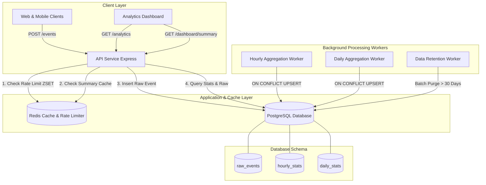

# Architecture Documentation & Data Flow

## System Architecture Overview

The High-Performance Time-Series Analytics API decouples high-volume synchronous event ingestion from heavy analytical data processing using PostgreSQL, Redis, and idempotent background workers.

## Data Lifecycle & Processing Layers

### 1. Ingestion & Rate Limiting (`POST /events`)
- Incoming events are evaluated by the **Redis Sliding Window Rate Limiter** (`rate_limit:<ip>`) using Redis ZSETs.
- Requests exceeding 200 req/min per IP are rejected immediately with `429 Too Many Requests`.
- Valid requests are stored in the `raw_events` table indexed by `timestamp` and `event_type`.

### 2. Rollup Aggregation Pipeline
- **Hourly Aggregation Worker**: Periodically executes `INSERT ... ON CONFLICT (bucket_time, event_type) DO UPDATE SET event_count = EXCLUDED.event_count` summarizing completed hours from `raw_events` into `hourly_stats`.
- **Daily Aggregation Worker**: Aggregates `hourly_stats` rows into `daily_stats` using idempotent UPSERTs.
- **Data Retention Worker**: Deletes `raw_events` older than 30 days in batches to prevent WAL bloat, preserving `hourly_stats` and `daily_stats` indefinitely.

### 3. Dynamic Query Routing (`GET /analytics`)
- Serves long-term historical analytics from pre-aggregated summary tables (`hourly_stats` / `daily_stats`).
- Combines completed bucket data with un-aggregated real-time metrics from `raw_events` for ongoing hours/days, guaranteeing <500ms response latency over millions of rows.

### 4. Response Caching (`GET /dashboard/summary`)
- Serves dashboard metrics directly from Redis cache (`cache:dashboard:summary`) with a 60-second TTL.
- Eliminates redundant database queries during peak dashboard usage.
